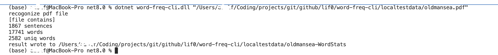

# word-freq-cli
word-freq-cli is a simple command-line tool that counts the most frequent words, characters, or symbols in a file.


# Example
We want count word in book `The Old Man and the Sea By Ernest Hemingway`

Use config:
```Json
{
  "Sentence": {
    "Split": {
      "Separator": [".", "•"],
      "Options": "RemoveEmptyEntries"
    },
    "Suspend": [
      "The Old Man and the Sea",
      "By Ernest Hemingway",
      "To Charlie Shribner And To Max Perkins"
    ],
    "Normalize": {
      "Replace": {
        "“": "\"",
        "”": "\""
      },
      "ReplaceRegex": [
        {
          "Pattern": "\s+",
          "Replacement": " "
        },
        {
          "Pattern": "\s*-\s*\.?\s*\d+\s*\.?\s*",
          "Replacement": " "
        },
        {
          "Pattern": "\s*\.?\s*\d+\s*\.?\s*-\s*",
          "Replacement": " "
        },
        {
          "Pattern": "\s*\[\s*\d+\s*\]\s*",
          "Replacement": " "
        },
        {
          "Pattern": "\s*\d+\s*\.\s*\W\s*",
          "Replacement": " "
        },
        {
          "Pattern": "\s+",
          "Replacement": " "
        }
      ],
      "Trim": [" ", "\n", "\r", "\t", "-"]
    }
  },
  "Word": {
    "Split": {
      "Separator": [" ", "\n", "\r", "\t", ".", ",", "!", "?", ";", ":", "•"],
      "Options": "RemoveEmptyEntries"
    },
    "Suspend": [
      "the", "and", "he", "of", "it", "i", "to", "his", "was", "a", "in", "that", "as", "is"
    ],
    "Normalize": {
      "Replace": {},
      "ReplaceRegex": [
        {
          "Pattern": "\s+",
          "Replacement": ""
        },
        {
          "Pattern": "\d+",
          "Replacement": ""
        }
      ],
      "Trim": [" ", "\n", "\r", "\t", ".", ",", "!", "?", ";", ":", ".", "”", "“", "•", ")", "(", "\"", "[", "]", "-"],
      "TrimAfter": ["'", "’"],
      "ToLower": true
    }
  }
}
```

## Result
</img>

[See oldmansea-WordStats.txt](.github/assert/oldmansea-WordStats.txt)